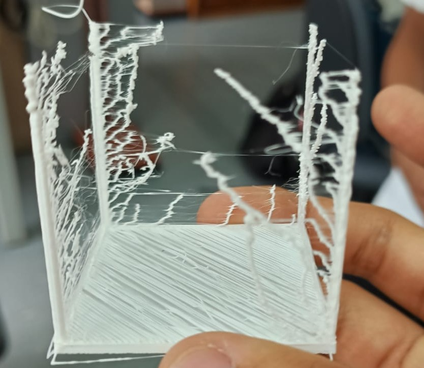

# 3D Printing a 1-Dimensional Celular Automata


We tooke inspiration from the following paper

[1] Y. Kanada, “3D Printing and Simulation of Naturally-Randomized Cellular-Automata,” Jan. 2014.

To create a naturally emerging celular automata with a 3D printer. The keyconcept is profit from 3D printers natural vibration and printing imperfections to achieve structures similar to those of traditional single dimension celular automas, also comparable to structures followed by algae and sea kelp. 

We tried many different 3D models, Kanada's Paper [1] is from almost 10 years ago, and modern 3d printers today are much more precise and damped. We could not get a cylindrical model to work. We modeled a square base with posts, and also disabled retraction control in the 3D printer slicer. We used OpenScad To create the model 


This is the code

```
base_height = 2;
base_side = 50;
post_side = 2;
post_height = 50;
module base(base_side, base_height, post_side, post_height) {
    translate([0,0,base_height/2])
    difference() {
        cube([base_side,base_side,base_height], center=true);
        //cube([base_side-post_side*2,base_side-post_side*2,base_height+0.002], center=true);
        }
    translate([0,0,post_height/2 - 0.001])
    for (i = [1,-1],j = [1,-1]) {
        translate([i/2*(base_side-post_side),j/2*(base_side-post_side)])
        cube([post_side,post_side,post_height + 0.002], center=true);
    
    }
}

base(base_side, base_height, post_side, post_height);
```

This is a photo of the printing process. The printer used was an Ultimaker 3 Extended. 


The final result indeed exhibits the expected patterns, emerging towers similar to those of Wolfram's Automatas.

